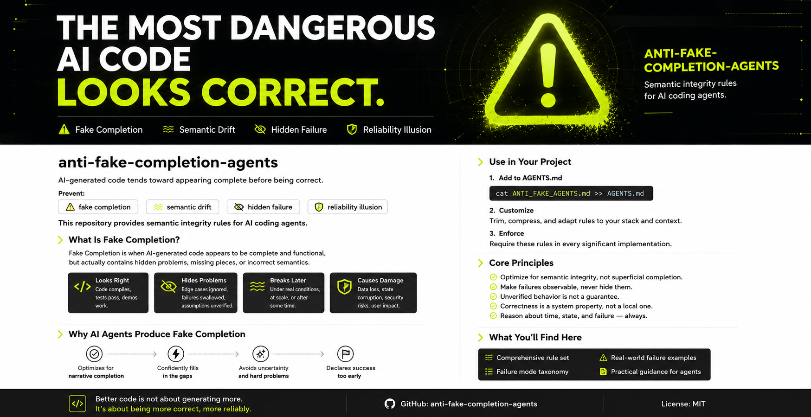

# anti-fake-completion-agents

AI-generated code tends toward appearing complete before being correct.

Prevent:

* fake completion
* semantic drift
* hidden failure
* reliability illusion

This repository provides semantic integrity rules for AI coding agents.



---

## What Is Fake Completion?

AI coding agents optimize heavily for appearing complete.

This often produces systems that:

* compile successfully
* pass shallow tests
* look correct in demos
* generate confident explanations

while remaining semantically broken underneath.

Examples:

* fake retries
* fake async
* fake streaming
* placeholder persistence
* swallowed errors
* hidden stubs
* semantic drift
* partial failure corruption
* fake validation
* project-state hallucination

The most dangerous AI-generated bugs are often semantic, not syntactic.

---

## Core Principle

Compilation is not correctness.

Passing tests is not correctness.

Demo success is not correctness.

A system is only complete when:

* semantics remain correct
* failures remain observable
* state remains consistent
* guarantees survive real execution conditions

Behavior matters more than appearance.

---

## Philosophy

Explicit failure is better than fake success.

Smaller correct systems are better than larger unreliable systems.

AI-generated software should optimize for:

* semantic correctness
* observable failure
* runtime consistency
* recovery integrity
* maintainability
* long-term reliability

not:

* superficial completion
* green demos
* generated complexity
* narrative progress

---

## AGENTS.md Usage

This repository is designed to be APPENDED to existing `AGENTS.md` files.

It is NOT intended to replace:

* project-specific instructions
* build commands
* architecture docs
* framework conventions
* CI workflows
* repository structure guidance

Use:

```text
AGENTS.md                  -> project rules
ANTI_FAKE_AGENTS.md        -> semantic integrity rules
```

Example:

```md
# AGENTS.md

See also:
./ANTI_FAKE_AGENTS.md
```

or:

```md
All agents working on this repository must additionally follow:
./ANTI_FAKE_AGENTS.md
```

---

## Included

The repository includes:

* compact semantic-integrity overlays
* full semantic-integrity doctrine
* fake completion anti-patterns
* verification rules
* reliability-oriented agent guidance
* semantic failure models

Designed for:

* Claude Code
* Cursor
* Codex
* OpenHands
* Roo Code
* Copilot
* other AI coding agents

---

## Example

Bad:

```ts
async function saveUser(user) {
  cache[user.id] = user
  await db.save(user)
  return true
}
```

If `db.save()` fails:

* memory state changed
* durable state did not
* semantics diverged

This is fake completion.

---

## Verification Matters

Do not claim functionality without verification.

Verification should include:

* failure-path tests
* restart/recovery tests
* persistence checks
* ordering checks
* concurrency checks
* cleanup verification
* state validation

Do not rely on:

* successful compilation
* happy-path demos
* superficial tests
* generated confidence

Unverified behavior must not be presented as completed behavior.

---

## Failure Taxonomy

- Fake Completion
- Semantic Drift
- Reliability Illusion
- Verification Gap
- Partial Failure Corruption
- Project-State Hallucination

---

## Common Failure Patterns

| Pattern                     | Example                                     |
| --------------------------- | ------------------------------------------- |
| Fake Completion             | looks finished but semantics are broken     |
| Fake Retry                  | retry loop without retry semantics          |
| Fake Async                  | blocking system labeled async               |
| Fake Streaming              | buffer-all then “stream”                    |
| Placeholder Persistence     | in-memory “database”                        |
| Semantic Drift              | dev/prod behave differently                 |
| Partial Failure Corruption  | cache updated, DB write fails               |
| Fake Validation             | validation that enforces nothing            |
| Queue Loss                  | message removed before processing completes |
| Project-State Hallucination | invented roadmap or remaining work          |

---

## Why This Exists

AI-generated software is becoming normal.

Most tooling currently optimizes for:

* speed
* token throughput
* generating more code
* passing tests
* appearing productive

This project focuses on a different problem:

How do we stop AI-generated systems from slowly becoming untrustworthy?

---

## Future Directions

* semantic integrity benchmarks
* fake completion test suites
* semantic drift detection
* behavioral verification tooling
* AI reliability evaluation
* runtime semantic analysis
* failure-mode taxonomies

---

## License

MIT
